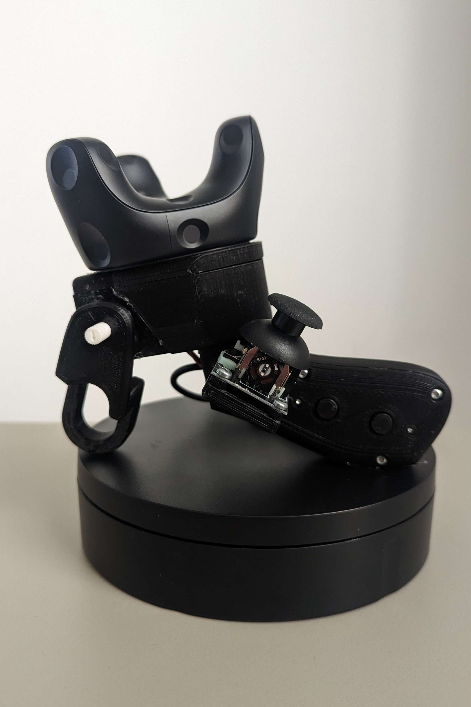
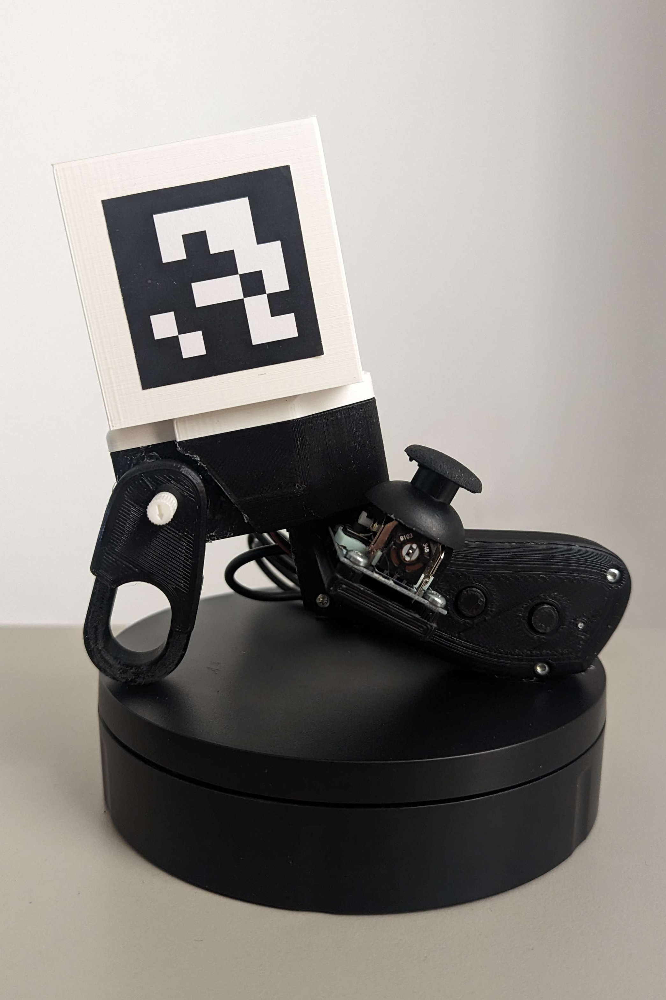
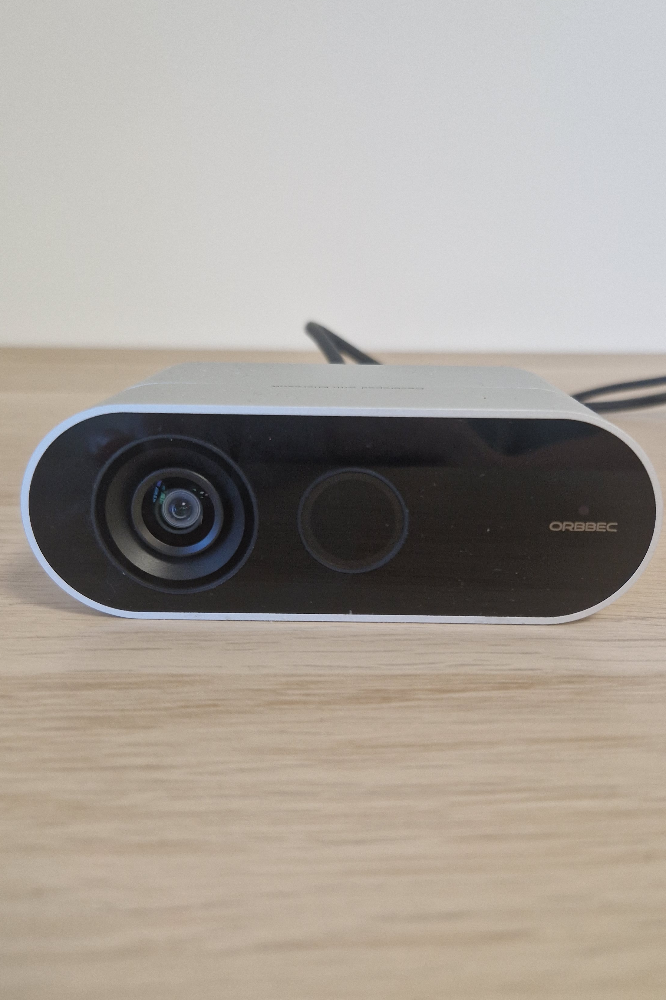
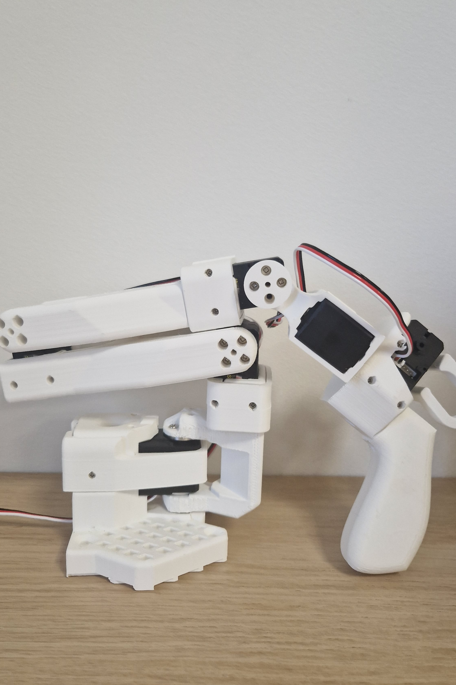
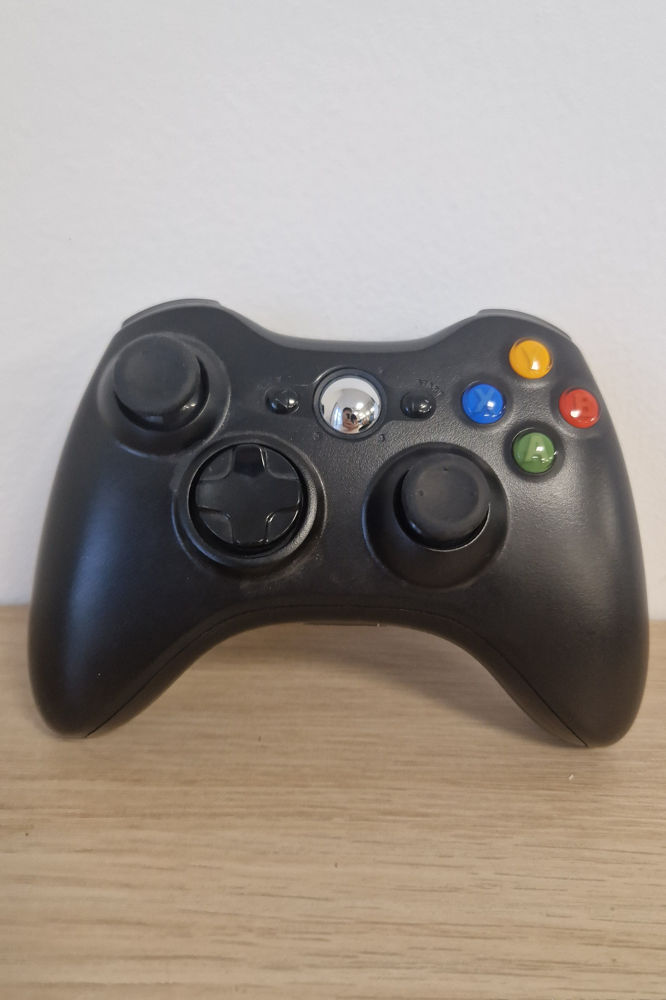
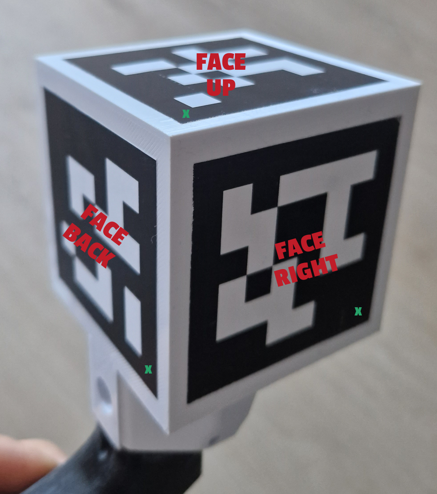
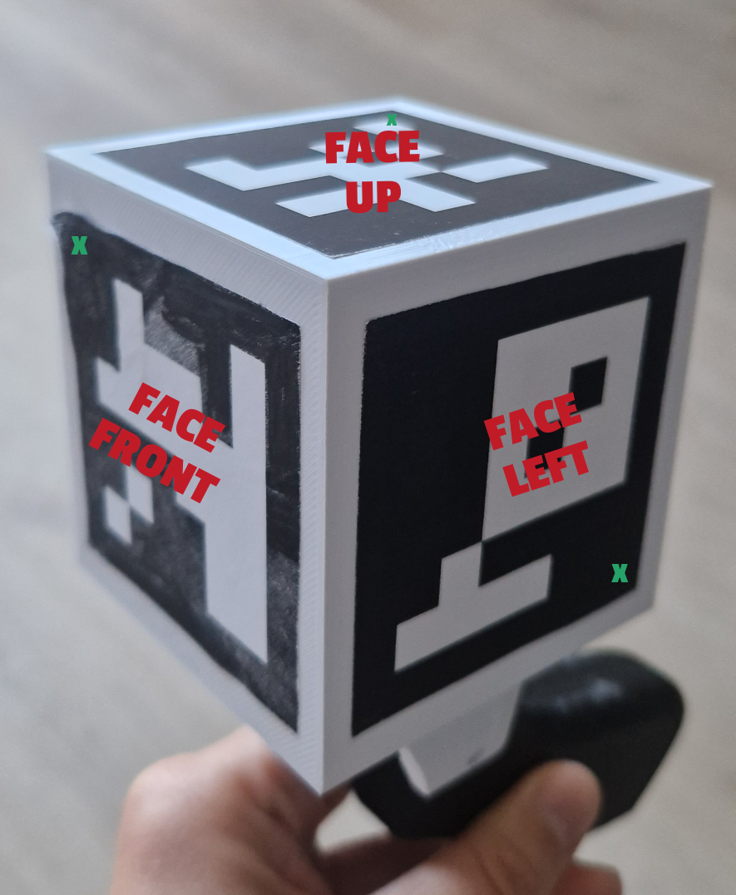

# Teleoperation without VR

A general project combining different methods for teleoperating Reachy2 without virtual reality. 

You can find the article on the development of the project and the technical details at this [link](AJOUT DU Medium link). 

## Methods available

There are currently 5 methods available:
- the custom controller with the Vive tracker
- the custom controller with the ArUco cube
- the RGBD camera
- the SOARM-100 robotic arm
- the gamepad

<p align = "center"> 
    
    
    
    
    
</p>


They all have their pros and cons, which you can read about in the article, or find out for yourself by testing them. 

## How to install this repository ?

1. Clone the repository 

        git clone https://github.com/pollen-robotics/reachy2_noVR_teleoperation.git

2. Install the dependencies, according to which modalities and robot you want to use (we recommand to do it in a virtual environment): 

        pip install -e ".[_modalities_]"
    
    For example, if you want to install the required libraries for Reachy2, Vive Tracker and RGBD Camera : <code> pip install -e ".[reachy2, vive, rgbd]"</code>
    
    The options are : 
    - *reachy2*
    - *vive*
    - *aruco*
    - *rgbd*
    - *arm*
    - *gamepad*
    - *all*

3. Apply the dev rules: 

        sudo cp 11-noVR.setup.rules /etc/udev/rules.d/
        sudo udevadm control --reload-rules && sudo udevadm trigger

> Be careful, if you're using the RGBD modality with the supplied Orbbec class, you need to manually install the library *pyorbbecsdk*. The instructions are below in the specific [RGBD Camera section](#how-to-set-up-each-modality). 

## How to use it ?
The project configuration file is used to select a particular **teleoperation mode**. 
You can therefore modify it according to **which modality** you want to use. 

To do this, go to the project's config.yaml file:

```
cd noVR_teleoperation
nano config.yaml 
```

The first 5 lines are essential to set-up the project : 

- **robot_ip & fake_only**: 
	
    You can change *localhost* for the ip address of your robot  - *if you don't know how to find your Reachy2's IP address, go [there](https://pollen-robotics.github.io/reachy2-docs/developing-with-reachy-2/getting-started-sdk/connect-reachy2/)*. 

	The *fake_only* parameter is a security that ensures that you only connect to a robot in simulation mode. 
    > If you enter an IP address that corresponds to a robot in real mode (i.e. it is the physical robot that is supposed to be moving), the connection will not be made. If you want to connect to a robot in normal mode, you need to disable this security by changing the *fake_only* parameter to 'false'.

- **tracker_type**: the modality you want to use (among 'aruco', 'vive', 'rgbd', 'arm', 'gamepad')

- **control_mode**: some of the methods can be used to control either a single arm or both arms (Tracker Vive, ArUco cube, SOARM-100): you therefore need to specify *‘dual_arm’*, *‘l_arm’* (for the left arm) or *‘r_arm’* (for the right arm).

- **mirror_mode** : if mirror_mode is set to *true*, you can control the robot in mirror mode, i.e. you can control it face to face, your right arm will control its left arm and vice versa. Otherwise, the robot will be controlled normally.

The rest of the parameters are specific to each teleoperation technique, and we will describe the set-up of each one in details below. 
> *Don't forget to CTRL+X then Y to save the config.yaml and exit*

Then you can launch the teleoperation program :
<code>python -m main </code>

> Be careful that the robot will **bent its arms** to 90° when the teleoperation is launched. So make sure there are **no obstacles** in its path (if it is too close to a table, for example). 

## What about teleoperating other robots ?
For the moment, only Reachy2 is available, as this projet was developed around it, but there are plans to add other robots. 

If you'd like to add your own robot, it is possible ! You have to add a child class to the **Robot** one (in the robot folder), adjusting the various methods for controlling the robot's parts, and change the initialization of the **Teleoperation** class in the *teleoperation.py* file, at the **self.robot** level. 
Feel free to test it and to suggest your additions!


## How to set-up each modality

<details>
<summary> <span style="font-size: 1.2em;"><strong> Vive Tracker & ArUco cube </strong></span></summary>

These two techniques use the [SOARM-100](https://github.com/TheRobotStudio/SO-ARM100/tree/main) leader joystick, that we have slightly tuned : 
- add of a **support** on top to be able to switch easily from **Vive tracker** (screwed onto it) to the **ArUco cube**.
- add of a **joystick** and **buttons**, so you can control several parts and switch modes with an **Arduino** system.
- tuning of the trigger, so you can use either a Feetech **motor** or a **potentiometer**. 

You can find all the CAO files and the tutorials on how to make your own custom controller there : [lien vers explications]


<details>
<summary><span style="font-size: 1.1em;"><strong>Vive Tracker </strong></span></summary>

This modality requires 1 Vive tracker for each controller used (it is possible to teleoperate one or both arms), a Vive base station for it to be detected and SteamVR to get data. 

<details>
<summary> Download <b>Steam</b> & <b>SteamVR</b> and enable the headset-free mode:</summary>

1. Install Steam, as well as Python and OpenVR dependencies (we recommend to do it in a virtual environment)

<code> sudo apt-get install steam libsdl2-dev libvulkan-dev libudev-dev libssl-dev zlib1g-dev python-pip</code>

2. Make Steam account & Log in.

3. Install SteamVR : click on Library > VR > Tools > SteamVR

4. Make a Symbolic Link from libudev.so.0 to libudev.so.1 for SteamVR to use

<code>sudo ln -s /lib/x86_64-linux-gnu/libudev.so.1 /lib/x86_64-linux-gnu/libudev.so.0</code>

5. Install pyopenvr :  <code>sudo pip install -U pip openvr</code>

6. Disable the headset requirement : 
there are 2 files to modify using those commands on a terminal : 

    a. <code>gedit ~/.steam/steam/steamapps/common/SteamVR/resources/settings/default.vrsettings</code>
    
    Change the value of "requireHmd" to *false*, "forcedDriver" to *null*, and 'activateMultipleDrivers" to *true*. 

    b. <code>gedit ~/.steam/steam/steamapps/common/SteamVR/drivers/null/resources/settings/default.vrsettings </code>

    Change the value of "enable" to *true*. 
> Be careful that SteamVR updates can sometimes overwrite changes to files. If the base station and trackers are no longer detected, don't hesitate to check that the changes are still there. If not, edit again and restart SteamVR.


</details>

To launch the teleoperation, it needs :
- Running SteamVR
- Vive Base Station plugged, at least 1m away from the trackers, with no obstacles in the way (avoid being too close to a computer, which can interfere with the signal)
- Detected trackers - *You can find out more about pairing trackers on the [Vive website](https://www.vive.com/us/support/tracker3/category_howto/pairing-vive-tracker.html)*

You need to find the name of your Vive Trackers to put them in the config file [COMPLETER] 

</details>
<details>
<summary><span style="font-size: 1.1em;"><strong>ArUco cube</strong></span></summary>

What you need is :
- an ArUco cube 
- a camera

1. **The cube**

You need to print the provided cube (lien à ajouter), in white for a better detection. Then, you have to print the ArUco markers : the PDFs for the markers are in the *controller_design_utils* folder. They are arranged so that the middle face is placed on the top face of the cube, when the joystick handle is facing you, and the other faces must be folded to either side of the top face. The first is for the right hand and the second is for the left hand. 

If you want to customise your ArUco cubes yourself, you can. 
 Use [this site](https://fodi.github.io/arucosheetgen/) to generate the sheet with the markers (we use ArUco 6x6 dictionary).  Then, paste them at the center of each face, as shown in the diagram below, with the cross representing the top left corner of the marker. 

<p align = "center"> 
    
    
</p>

You can adjust the markers id (order is back, up, front, left, right, down) and size directly in the config file, in the ARUCO section. 

2. **The camera**

You can use a camera or your smartphone. To select it, you need to change the config file in the ARUCO section. 

<ins>If you're using a camera : </ins>
- set the usb_mode to *true*
- set the camera_id : the integrated one is '*0*', if it's an external camera, the number is the index in the order of usb-connected devices.

<ins>If you're using your smartphone :</ins>
- install the app "IP webcam" on your phone, then click on the 3 dots and "Start the server"
- set the usb_mode to *false*
- set the camera_id : use the IPv4 address written on the app (between http:// and :8080, not included - *it should be something like '172.16.0.56'*) 
- make sure your phone and computer are on the same network, and that your phone stays unlocked. 

By default, *with_calibration* parameter is set to *false* in the config file. That means that the intrinsic camera parameters used are estimated **manually** (which is sufficient for cameras with little distortion such as integrated computer cameras). But you have the possibility to use **specific camera matrix and distorsion coefficients**, by setting *with_calibration* to true and replacing the *camera_matrix* and *dist_coeffs* with your own values. 
We also provide the script to **perform your calibration** with a ChArUco board. 

<details>
<summary> Steps to calibrate your camera </summary>

1. Go to the camera_calibration folder :
<code> cd camera_calibration </code>

2. Generate your ChArUco board : 
<code> python3 charuco_generator.py </code>

3. Print it and paste it on a rigid surface

4. Launch the calibration script : <code>python3 camera_calibration.py</code>

By default, the camera taken into account is the one built into the computer, but you can select the one you want to calibrate by adding the --usb_mode (true or false) and -- camera_id (index or IP address) arguments: for example by executing <code> python3 camera_calibration.py --usb-mode false --camera_id "172.16.0.56"</code>. 

Move the board in all directions, the important thing is to have different orientations, close-up shots, distant shots and angled shots. This takes 20 images, in which the board must be placed quite a distance from the previous image. 

Then, it saves the parameters in the camera_parameters folder, but also by updating the teleoperation config file. 

</details>

</details>

#### Both

You need to modify the config file to adjust your controller settings:

<ins>For all :</ins>
- gripper_type: set to 'feetech' or 'potentiometer' depending on what you have chosen for the joystick trigger
- arduino_ports: you don't normally need to change this, as the name indicated is setup in the dev rules, but if necessary you can replace it with the port of your arduino (such as 'ttyACM0').
    > if the pre-recorded name doesn't work, you can find the port name by doing ```ls /dev``` in your terminal, and looking for the ttyACM[0-10] linked to it.

<ins> For controllers with Feetech motors :</ins>
- feetech_ports: you don't normally need to change this, as the name indicated is setup in the dev rules, but if necessary you can replace it with the port of your arduino (such as 'ttyACM0').
- feetech_gripper_joints_limit: you can adapt the range of gripper values to your own trigger movement amplitude if required.

<ins> For controllers with potentiometers:</ins>
- potentiometer_gripper_joints_limit: you can adapt the range of gripper values to your own trigger movement amplitude if required.


**To set up your environment :**
Once your config file and your controller(s) are ready (with a Vive tracker or a ArUco cube), you can launch the main script. Take your controller(s), the pose during the initialization will be the reference pose for the arm to be bent at 90°. 


</details>

<details>
<summary> <span style="font-size: 1.2em;"><strong> RGBD Camera </strong></span></summary>

The posture detection model is [Mediapipe](https://chuoling.github.io/mediapipe/solutions/holistic.html). 

We use an [Orbbec Femto Bold](https://www.orbbec.com/products/tof-camera/femto-bolt/), but you are free to adapt the code to use your own RGBD Camera. 
To use an Orbbec camera, you need the package **pyorbbecsdk**.

<details>
<summary><strong>Download pyorbbecsdk : </strong></summary>

1. Clone the repository (virtual environment recommended) : <code> git clone https://github.com/orbbec/pyorbbecsdk.git </code>

2. Make sure you have the needed dependencies : <code> sudo apt-get install python3-dev python3-pip python3-opencv </code>

3. Install the requirements : 
    
    ```
    cd pyorbbecsdk
    pip3 install -r requirements.txt 
    ```

4. Create a folder for the build : 

        mkdir build
        cd build
        cmake -Dpybind11_DIR=`pybind11-config --cmakedir` ..
        

5. Build the wrapper : 
        
        make -j4
        make install

6. Add the library directory to the list (*to know your python path, write <code> which python </code> in your terminal*): 

    <code>export PYTHONPATH=$PYTHONPATH:$(pwd)/install/lib/</code>

7. Import and apply dev rules : 

    ```
    sudo bash ./scripts/install_udev_rules.sh
    sudo udevadm control --reload-rules && sudo udevadm trigger
    ```

8. Install the library : 
    
    ```
    cd ..
    pip install -e .
    ```

</details>


To set-up your environment : 
- Position the camera high up, to avoid getting occlusion. A calibration will be performed when the script is launched to calculate the orientation and adapt the calculation of the poses. 

- Position yourself with your head straight and your arms bent at 90°.
> Note that the script will wait until your hands are correctly positioned before launching the teleoperation, to avoid any sudden movements by the robot. 

- You can move your head and your two arms, keeping your torso static. You can open and close the grippers by moving your index finger and thumb towards or away from each other. The orientation of the robot's hand is defined by the orientation of the elbow-wrist vector.

- To stop the teleoperation, you have to tilt the head downwards for a prolonged period of time, until the streaming window closes. 


</details>

<details>
<summary> <span style="font-size: 1.2em;"><strong> SOARM-100 </strong></span></summary>


</details>

<details>
<summary> <span style="font-size: 1.2em;"><strong> Gamepad </strong></span></summary>


</details>
