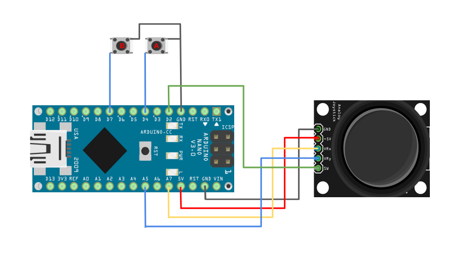
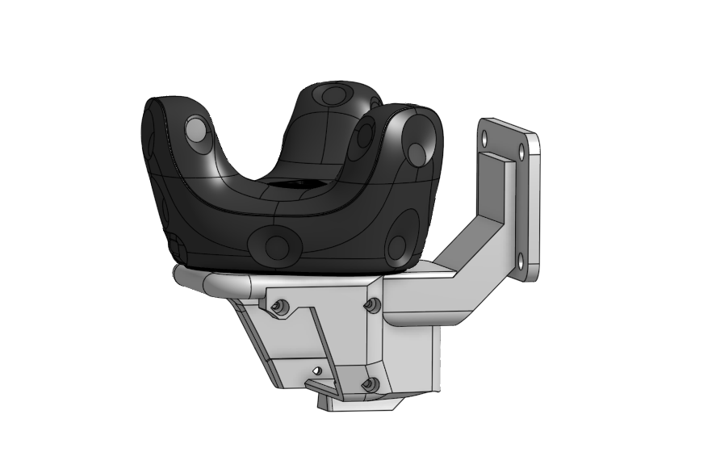
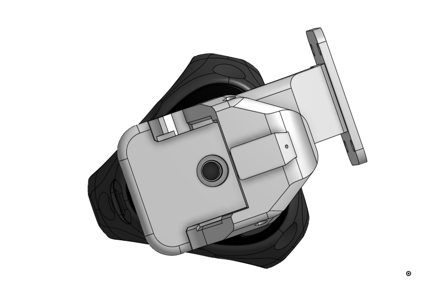
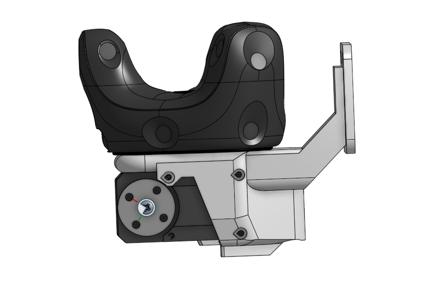
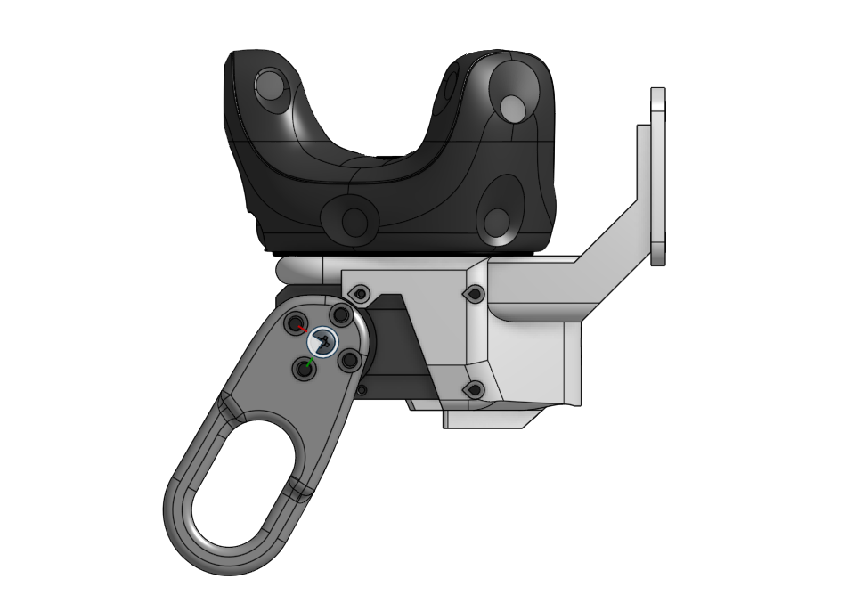
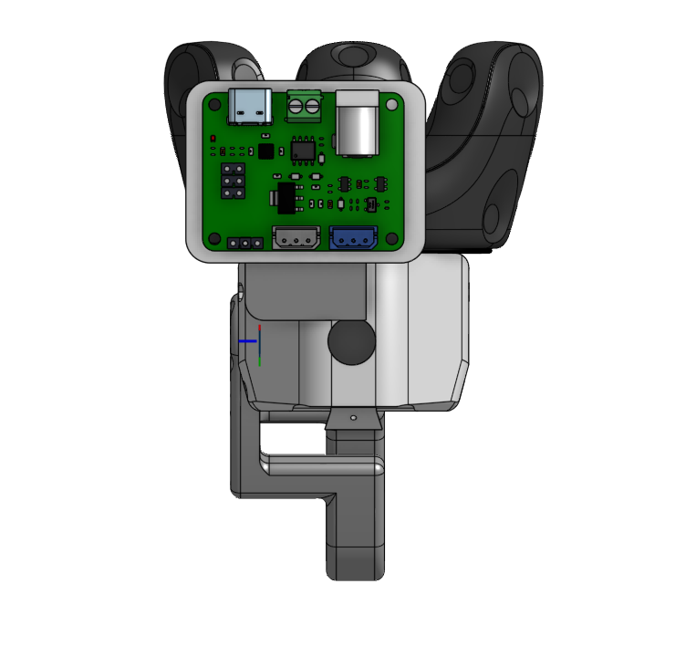
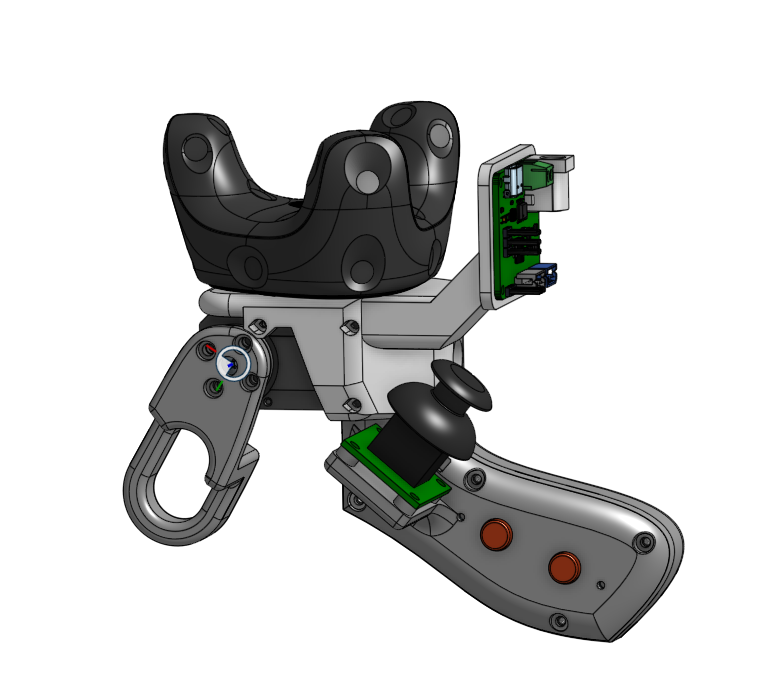
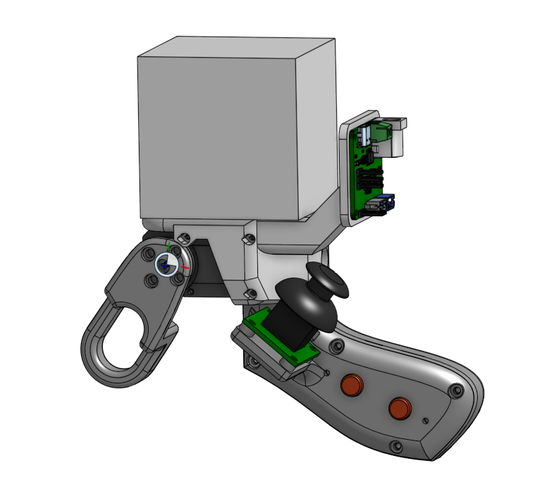

# Assembly guide

This is a DIY controller. Two variants are possible:
- A version using a **Vive Tracker**
- A **low-cost version** using an **ArUco** cube

## Requirements : 

You will need : 
- A 3D printer
- A soldering iron, and basic electronics tools and skills
- Some wire
- some screws :
    - M2.2x5mm x2 
    - M2.5x8mm x4
    - M3x6mm x4
    - M2.2x6mm x2

## BOM

### ArUco Controller (~25 €)

| **Component**            | **Quantity** | **Unit Price (€)** | **Total (€)** | **Link** |
|--------------------------|--------------|---------------------|---------------|----------|
| Arduino Nano Every       | 1            | 2.5                 | 2.5           | [AliExpress](https://fr.aliexpress.com/item/1005007475356474.html) |
| Push Button              | 2            | 0.1                 | 0.2           | [AliExpress](https://fr.aliexpress.com/item/1005003938244847.html) |
| Joystick Module          | 1            | 1.5                 | 1.5           | [AliExpress](https://fr.aliexpress.com/item/1005005317345964.html) |
| Micro USB Cable          | 1            | 5                   | 5             | [AliExpress](https://fr.aliexpress.com/item/1005006017853917.html) |
| PLA Filament (~130g)     | ~130g        | 4                   | 4             | —        |
| Motor Control Board      | 1            | 6               | 6          | [AliExpress](https://fr.aliexpress.com/item/1005006054189812.html) |
| Feetech STS3215 Servo    | 1            | 14                  | 20            | [Alibaba](https://www.alibaba.com/product-detail/Robot-Servo-STS3215-7-4V-19kg_1600052037414.html?spm=a2700.galleryofferlist.normal_offer.d_title.26cb13a0on0spo) |
| **Total**                |              |                     |**33.20€**   |          |

> ~68€ for two controllers.
---

### Vive Controller (~266 €)

| **Component**            | **Quantity** | **Unit Price (€)** | **Total (€)** | **Link** |
|--------------------------|--------------|---------------------|---------------|----------|
| Arduino Nano Every       | 1            | 2.5                 | 2.5           | [AliExpress](https://fr.aliexpress.com/item/1005007475356474.html) |
| Push Button              | 2            | 0.1                 | 0.2           | [AliExpress](https://fr.aliexpress.com/item/1005003938244847.html) |
| Joystick Module          | 1            | 1.5                 | 1.5           | [AliExpress](https://fr.aliexpress.com/item/1005005317345964.html) |
| Micro USB Cable          | 1            | 5                   | 5             | [AliExpress](https://fr.aliexpress.com/item/1005006017853917.html) |
| PLA Filament (~130g)     | ~130g        | 4                   | 4             | —        |
| Motor Control Board      | 1            | 6                   | 6             | [AliExpress](https://fr.aliexpress.com/item/1005006054189812.html) |
| Feetech STS3215 Servo    | 1            | 20                  | 14            | [Alibaba](https://www.alibaba.com/product-detail/Robot-Servo-STS3215-7-4V-19kg_1600052037414.html?spm=a2700.galleryofferlist.normal_offer.d_title.26cb13a0on0spo) |
| Vive Tracker             | 1            | 100                 | 100           | [Materiel.net](https://www.materiel.net/produit/202103080068.html?gQT=2) |
| Vive Base Station 2.0    | 1            | 140                 | 140           | [Immersive Display](https://immersive-display.com/fr/htc-vive-pro-eye/553-station-de-base-htc-vive-steamvr-20.html) |
| **Total**                |              |                     | **273.20 €**   |          |

> 💡 One Lighthouse can track two Vive Trackers → ~408 € for two controllers.

## 3D Printed Parts

You can find all the STL files in the [`project_resources` folder](../STL_files/feetech_controller/)

For **each controller**, print the following:

### Core parts:
- `side`_feetech_handle1 ×1  
- `side`_feetech_handle2 ×1  
- `side`_feetech_trigger ×1
- button ×2  
- button_support ×1  

### Tracking-specific top:
- **ArUco version:** `side`_aruco_controller
- **Vive version:** `side`_vive_controller

> Replace  `side` by `left`/`right` based on the controller side you want.

## Assembly Instructions

### 1. Print the controller parts

Use your preferred slicer and printer to produce the components listed above.

### 2. Assemble the controller

#### Assemble the handle

- Insert the push-buttons into their holders
  

    
    
  

> 💡 you can add hot glue to secure them in place

- Add the two buttons on top of the push-button

    

- Screw the button-holder to the handle with two PLATCB M2.2 × 5 plastic-tapping screws.

    

- Position the joystick and fasten it using one PLATCB M3 × 6 plastic-tapping screw.

    

- Complete the wiring exactly as shown in the schematic.

    

- Fix the Arduino board to its standoffs and attach the cable to it

    
    

- Close the handle, tightening the two halves together with four M2.5x8 x4 screws.

    

#### Assemble the upper part of the controller

- **For Vive controller only** : Attach the Vive Tracker on top of the handle.

 
   
   

> If you don’t have the matching screw, you can 3D-print the provided mount.

- Insert the Feetech motor into its dedicated printed slot.

 
   

> 💡 The motor should slide into place and align with the mounting holes.
Once in position, secure it using the 6 screws provided with the motor.

- Mount the trigger onto the motor shaft.

 
  

> 💡 Before inserting the trigger, ensure the motor is set to position 0. You can use the Lerobot library to confirm that the motor is correctly identified as ID 1 and is at the neutral position.

- Fix the Bus Servo Adapter Board to the back of the controller.

 
  

#### Final assembly

- Slide the upper part of the controller onto the handle — Once fully inserted, secure them together by adding M2.2x6mm screw at the designated point.

 
   
   

### 3. Upload the code

- Open the PlatformIO project
- Connect the Arduino Nano to your computer via USB
- Upload the firmware to the board

---